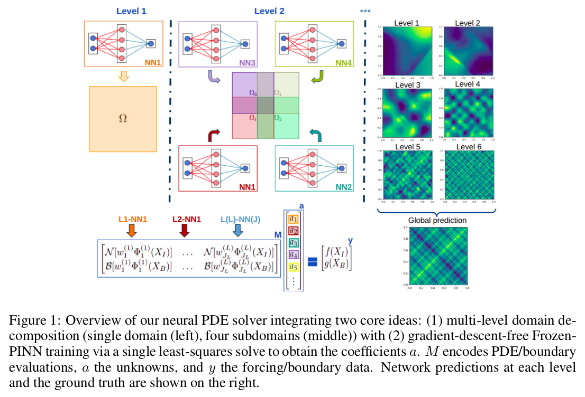

# Multilevel-Frozen-PINNS

[](https://www.python.org/)
[](LICENSE)

---

This project builds on the existing SWIM Network and Frozen-PINN projects, with the aim of adding multilevel domain decomposition capabilities to the Frozen-PINN framework to enhance the performance of Frozen-PINN models for solving PDEs with multiscale solution components. This branch is created for reproducibility of the code of published workshop paper [Fast Multiscale PDE Solvers via Multilevel Domain Decomposition and Random Features](https://openreview.net/forum?id=wA6SsMmftX) at [ICLR 2026 Workshop AI & PDE](https://sites.google.com/impatech.edu.br/ai-pde).


## Reproducibility

Follow the steps below to reproduce the experiments reported in this repository.

### Step 1: Environment Setup

Create the project virtual environment and install dependencies using `uv`(for installing uv see: [uv installation](https://docs.astral.sh/uv/getting-started/installation/#standalone-installer)):

```bash
uv sync
```

---

### Step 2: Running Experiments

##### Experiment 1: Homogeneous Laplacian Experiment

The results for this experiment can be reproduced by running the `experiments/2D/homogeneous_laplacian.ipynb` notebook.

---

##### Experiment 2: Multiscale Laplacian Weak Scaling Experiment

For this experiment, the model must first be trained.
Run the following command for training of the models:

```bash
uv run experiments/2D/laplacian2d_weak_scaling_run.py
```

After training is completed, the plots and results can be reproduced by running `experiments/2D/laplacian2d_weak_scaling_plot.ipynb` notebook:

---

##### Experiment 3: Conditioning Experiment

The results for this experiment can be reproduced by running the `experiments/model_based_studies/conditioning_study.ipynb` notebook.

---

### Notes

- Ensure the environment has been set up before running any experiment.
- Some experiments may depend on trained models generated in previous steps.
- Generated results and figures will be stored in the `results/` or `plots/` directory.

---

## Related Works

[1] Chinmay Datar, Taniya Kapoor, Abhishek Chandra, Qing Sun, Iryna Burak, Erik Lien Bolager, Anna Veselovska, Massimo Fornasier, and Felix Dietrich. Solving partial differential equations with sampled neural networks. arXiv preprint [arXiv:2405.20836](https://arxiv.org/abs/2405.20836), 2024.

[2] E. Bolager, I. Burak, C. Datar, Q. Sun, F. Dietrich. Sampling weights of deep neural networks. [arXiv:2306.16830](https://arxiv.org/abs/2306.16830), 2023.

[3] Victorita Dolean, Alexander Heinlein, Siddhartha Mishra, and Ben Moseley. Multilevel domain decomposition-based architectures for physics-informed neural networks. Computer Methods in Applied Mechanics and Engineering, 429:117116, September 2024. ISSN 0045-7825. doi: 10.1016/j.cma.2024.117116. URL [http://dx.doi.org/10.1016/j.cma.2024.117116](https://www.sciencedirect.com/science/article/pii/S0045782524003724?via%3Dihub).
